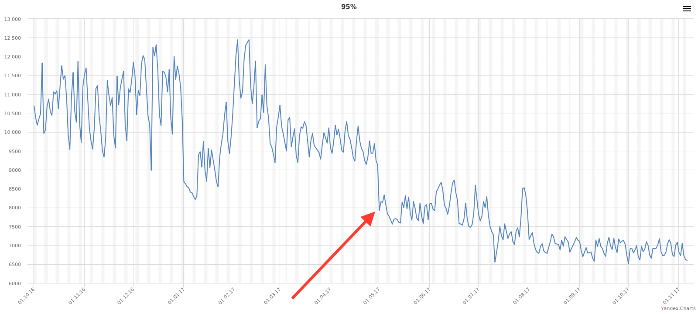

---

layout: yandex2

style: |
    .center {
        text-align: center;
    }
    
    .center img {
        margin: 0 auto;
    }
    
    .image-container {
        height: 100%;
    }
    
    .image {
        height: 90%;
        max-width: 100%;
    }

    .video-container {
        height: 90%;
        text-align: center;
    }
    
    .video {
        height: 100%;
    }
    
    .video-container.right {
        float: right
    }
---

# {:.logo}

## {{ site.presentation.title }}
{:.title}

### {{ site.presentation.service }}

<div class="authors">

<p>{{ site.author.name }}, {{ site.author.position }}</p>



<p>{{ site.author2.name }}, {{ site.author2.position }}</p>


</div>

## Поисковая выдача
{:.section}

### Наш проект

## SERP (Search Engine Result Page)
{:.section}

### Наш проект

## SERP

<div class="video-container right">
    <video class="video" autoplay loop>
        <source src="serp-screens/movie.mp4">
    </video>
</div>

**Одна страница**

**Большая вариативность**

**Три платформы**

**Больше 50 разработчиков**

**Разделение на виртуальные команды**

## Работа над фичей
{:.center}

<div class="image-container">
    
</div>

## Метрики
{:.section}

## Метрики

Метрики – способ получения обратной связи после разработки и тестирования

## Онлайн-измерения

RUM – real user measurement

**Navigation Timing API**

**Resource Timing API**

**Paint Timing API**

**High Resolution Time – собственные таймеры**

## Navigation Timing API

```js
const tm = performance.timing
const documentMetrics = {
    tcpHandshake: tm.connectEnd - tm.connectStart,
    firstByte: tm.responseStart - tm.connectEnd,
    download: tm.responseEnd - tm.responseStart,
    domLoaded: tm.domContentLoadedEventStart - tm.responseStart,
    // …
};
```

## Resource Timing API

```js
const entry = performance.getEntriesByName('https://yastatic.net/jquery.js')[0]
const resourceMetrics = {
    cacheHit: entry.transferSize === 0,
    tcpHandshake: entry.connectEnd - entry.connectStart,
    download: entry.responseEnd - entry.responseStart,
    // …
}
```

## Paint Timing API

```js
function getFirstPaintTime() {
    const paints = performance.getEntriesByType('paint')
    for (let paint of paints) {
        if (paint.name === 'first-contentful-paint') {
            return paint.startTime  
        }
    }
}
```

## Кастомные API для первой отрисовки

```js
function getFirstPaintTime() {
    if (typeof chrome !== 'undefined' && typeof chrome.loadTimes === 'function') {
        return chrome.loadTimes().firstPaintTime * 1000
    }

    if ('msFirstPaint' in performance.timing) {
        return performance.timing.msFirstPaint
    }
}
```

## Таймеры

```js
BEM.channel('i-bem').onFirst('init', () => {
    Rum.sendTimeMark('client-framework-inited', performance.now())
})
```

## Оценка времени отрисовки контента

```html
<script>
requestAnimationFrame(() => {
    Rum.sendTimeMark('content-paint-low', performance.now())
    requestAnimationFrame(() => {
        Rum.sendTimeMark('content-paint-high', performance.now())
    })
})
</script>
<div class="content">Hello, world!</div>
```

## АБ-тестирование

| Метрика               | Контроль,&nbsp;мс | Эксперимент,&nbsp;мс | Δ,&nbsp;мс | MW-тест  |
+-----------------------|-------------------|----------------------|------------|----------+
| Первый байт           | 380               |  375                 | -5         | 20       |
| Первая&nbsp;отрисовка | 420               |  450                 | 30         | 50       |
| Загрузка              | 878               |  932                 | 54         | **99.5** |
| Инициализация&nbsp;JS | 1200              |  1400                | 200        | **99.9** |


## Офлайн-измерения

|  Метрика                      |  База    | Пулл-реквест  |     Δ     |
+-------------------------------|----------|---------------|-----------|
|  Размер html, Кб (gzip)       |  80.2    |  100.2        |  **20**   |
|  Размер AJAX JSON, Кб  (gzip) |  15.3    |  15.8         |  0.5      |
|  Размер main.js, Кб  (br)     |  90      |  95           |  **5**    |
|  Время шаблонизации, мс       |  123     |  126          |  3        |


## Время шаблонизации и размер страницы

**Проблема – большая вариативность одной страницы**

**Решение – случайный набор реальных данных**

## Сбор данных

```sql
INSERT INTO
  `home/velocity/query_params`
SELECT
    `query_params`
FROM
    RANGE(`access-log`, `2017-11-01`, `2017-11-07`)
ORDER BY
  RANDOM(*)
LIMIT
    10000
;
```

## Сбор данных

```js
const queryParams = await getQueryParams('home/velocity/query_params')
const dataSet = await Promise.all(queryParams.map(paramsSet => {
    return makeJsonRequest('yandex.ru/search', paramsSet)
}))
saveDataSet(dataSet)
```

## Измерения для пулл-реквеста

```js
const dataSet = await getDataSet()
const baseResults = await Promise.all(dataSet.map(data => {
    return makeHtmlRequest('master.beta.yandex.ru/search', data)
}))
const prResults = await Promise.all(dataSet.map(data => {
    return makeHtmlRequest('pr-487.beta.yandex.ru/search', data)
}))
compare(baseResults, prResults)
```

## Результат измерений для пулл-реквеста

|  Метрика                      |  База    | Пулл-реквест  |     Δ     |
+-------------------------------|----------|---------------|-----------|
|  Размер html, Кб (gzip)       |  80.2    |  100.2        |  **20**   |
|  Размер AJAX JSON, Кб  (gzip) |  15.3    |  15.8         |  0.5      |
|  Размер main.js, Кб  (br)     |  90      |  95           |  **5**    |
|  Время шаблонизации, мс       |  123     |  126          |  3        |

## Измерения на потоке и поиск узких мест
{:.section}

## Время до инициализации JS, мс

<div class="image-container">
    
</div>

## Время до инициализации JS, мс

<div class="image-container">
    
</div>

## Поиск узких мест

```sql
SELECT 
    PERCENTILE(domLoading, 95) AS domLoadingP95,
    PERCENTILE(serpParseEnd, 95) AS serpParseEndP95,
    PERCENTILE(domLoaded, 95) AS domLoadedP95,
    PERCENTILE(clientFrameworkInited, 95) AS clientFrameworkInitedP95
FROM
    `home/velocity/dataset/2017-11-01`
;
```

## Поиск узких мест

| Метка времени             | Значение, мс |
+---------------------------|--------------+
| domLoadingP95             |     500      |
| serpParseEndP95           |     2520     |
| domLoadedP95              |     6000     |
| clientFrameworkInitedP95  |     7000     | 

## Оптимизация

```html
<div class="serp-header">
    <!-- … -->
</div>
<link rel="preload" href="main.js" as="script">
```

## Перепроверяем

<div class="image-container">
    
</div>

## Интересные оптимизации

**Широко известные**

## Широко известные оптимизации

**Минификация всего текстового: html, js, css, svg**

**Оптимизация svg и бинарной графики**

**Сжатие статики в zopfli (gz) и brotli**

**Сжатие страницы с помощью gzip**

**CDN**

## Интересные оптимизации

**Широко известные**

**Инлайновые стили и скрипты**

## Интересные оптимизации

**Широко известные**

**Инлайновые стили и скрипты**

**Разделение кода**

## Интересные оптимизации

**Широко известные**

**Инлайновые стили и скрипты**

**Разделение кода**

**Прогрессивная загрузка страницы**

## Прогрессивная загрузка страницы (3G slow)

<div class="video-container">
    <video class="video" autoplay loop>
        <source src="load-video/video.mp4">
    </video>
</div>

## Интересные оптимизации

**Широко известные**

**Инлайновые стили и скрипты**

**Разделение кода**

**Прогрессивная загрузка страницы**

**Предзагрузка статики**

## Интересные оптимизации

**Широко известные**

**Инлайновые стили и скрипты**

**Разделение кода**

**Прогрессивная загрузка страницы**

**Предзагрузка статики**

**Лёгкая версия для медленных соединений**

## Интересные оптимизации

**Широко известные**

**Инлайновые стили и скрипты**

**Разделение кода**

**Прогрессивная загрузка страницы**

**Предзагрузка статики**

**Лёгкая версия для медленных соединений**

**Много других в работе**

## Отказались

**Кэш в LocalStorage**

## Продолжение следует…
{:.section}

### На сегодня всё

## Контакты 
{:.contacts}



<figure markdown="1">

### {{ site.author.name }}


{{ site.author.position }}


</figure>





<figure markdown="1">

### {{ site.author2.name }}


{{ site.author2.position }}


</figure>



<!-- разделитель контактов -->
-------

<!-- left -->
- {:.github}andre487
- {:.mail}andre487@yandex-team.ru
- {:.twitter}@andre487

<!-- right -->
- {:.phone}Nexus 5X
- {:.telegram}andre487

<!-- 

- {:.mail}andre487@yandex-team.ru
- {:.phone}Nexus 5X
- {:.github}andre487
- {:.twitter}@author
- {:.telegram}author
- {:.skype}author
- {:.instagram}author
- {:.facebook}author
- {:.vk}@author
- {:.ok}@author

-->
