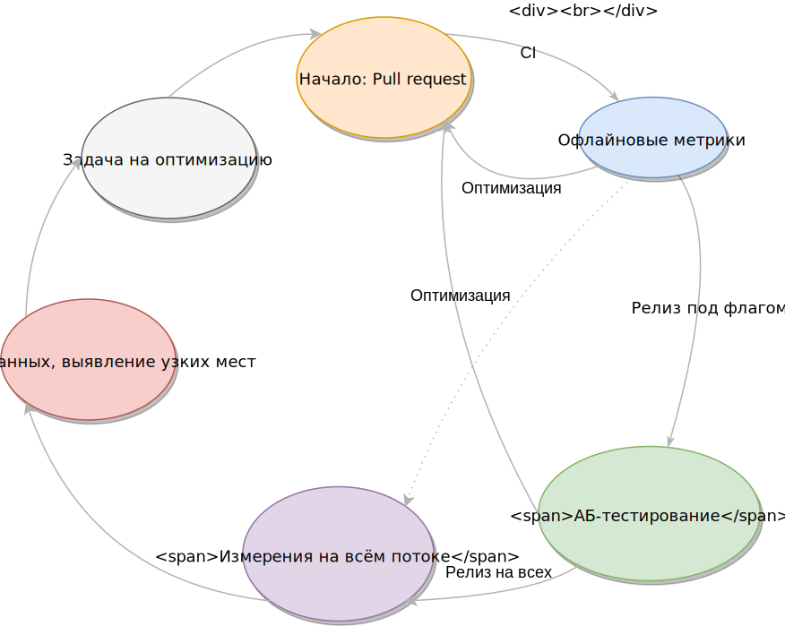
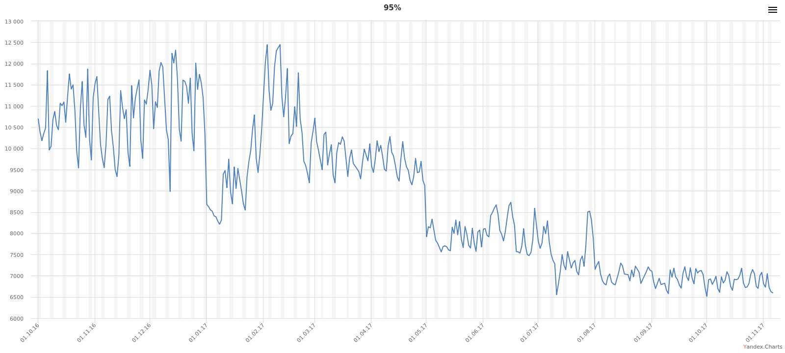

---

layout: yandex2

style: |
    .center {
        text-align: center;
    }
    
    .center img {
        margin: 0 auto;
    }

    .video-container {
        height: 90%;
        text-align: center;
    }
    
    .video {
        height: 100%;
    }
---

# {:.logo}

## {{ site.presentation.title }}
{:.title}

### {{ site.presentation.service }}



{:.nda}


<div class="authors">

<p>{{ site.author.name }}, {{ site.author.position }}</p>



<p>{{ site.author2.name }}, {{ site.author2.position }}</p>


</div>

## Поисковая выдача
{:.section}

### Наш проект

## SERP (Search Engine Result Page)
{:.section}

### Наш проект

## SERP

**Одна страница**

**Большая вариативность**

**Больше 50 разработчиков**

## SERP

<div class="video-container">
    <video class="video" autoplay loop>
        <source src="serp-screens/movie.mp4">
    </video>
</div>

## Как мы работаем?
{:.section}

## Колесо скорости
{:.images .center}



## Онлайн-измерения

RUM – real user measurement

**Navigation Timing API**

**Resource Timing API**

**Paint Timing API**

**High Resolution Time – собственные таймеры**

## Navigation Timing API

```js
const tm = performance.timing
const loadMetrics = {
    wait: tm.domainLookupStart - tm.navigationStart,
    dns: tm.domainLookupEnd - tm.domainLookupStart,
    tcp: tm.connectEnd - tm.connectStart,
    tls: tm.connectEnd - tm.secureConnectionStart,
    ttfb: tm.responseStart - tm.connectEnd,
    download: tm.responseEnd - tm.responseStart,
    domLoading: tm.domLoading - tm.responseStart,
    domInteractive: tm.domInteractive - tm.responseStart,
    domLoaded: tm.domContentLoadedEventStart - tm.responseStart,
    domInit: tm.domContentLoadedEventEnd - tm.domContentLoadedEventStart,
}
```

## Resource Timing API

```js
const entry = performance.getEntriesByName('https://yastatic.net/jquery.js')[0]
const resTiming = {
    cacheHit: entry.transferSize === 0,
    wait: entry.domainLookupStart - entry.startTime,
    dns: entry.domainLookupEnd - entry.domainLookupStart,
    // …
    transferSize: entry.transferSize,
    duration: entry.duration,
}
```

## Paint Timing API

```js
function getFirstPaintTime() {
    const paints = performance.getEntriesByType('paint')
    for (let paint of paints) {
        if (paint.name === 'first-contentful-paint') {
            return paint.startTime  
        }
    }
}
```

## Кастомные API для первой отрисовки

```js
function getFirstPaintTime() {
    if (typeof chrome !== 'undefined' && typeof chrome.loadTimes === 'function') {
        return chrome.loadTimes().firstPaintTime * 1000
    }

    if ('msFirstPaint' in performance.timing) {
        return performance.timing.msFirstPaint
    }
}
```

## Таймеры

```js
BEM.channel('i-bem').onFirst('init', () => {
    Rum.sendTimeMark('client-framework-inited', performance.now())
})
```

## Оценка отрисовки контента

```html
<script>
requestAnimationFrame(() => {
    Rum.sendTimeMark('content-paint-low', performance.now())
    requestAnimationFrame(() => {
        Rum.sendTimeMark('content-paint-high', performance.now())
    })
})
</script>
<div class="content">Hello, world!</div>
```

## АБ-тестирование

|  Метрика                 |  Контроль, мс    | Эксперимент, мс |     Δ, мс |  MW-тест, % |
+--------------------------|------------------|-----------------|-----------|-------------+
|  TTFB                    |  380             |  375            |  -5       |  20         |
|  TTFP                    |  420             |  450            |  30       |  50         |
|  Download                |  878             |  932            |  54       |  **99.5**   |
|  Cont. paint low         |  900             |  950            |  50       |  **100**    |
|  Cont. paint high        |  1000            |  1100           |  100      |  98         |
|  Main.JS duration        |  300             |  400            |  100      |  **100**    |
|  JS inited               |  1200            |  1400           |  200      |  **99.9**   |


## Офлайн-измерения

|  Метрика                      |  База    | Пулл-реквест  |     Δ     |
+-------------------------------|----------|---------------|-----------|
|  Размер html, Кб (gzip)       |  80.2    |  100.2        |  **20**   |
|  Размер AJAX JSON, Кб  (gzip) |  15.3    |  15.8         |  0.5      |
|  Размер main.js, Кб  (br)     |  90      |  95           |  **5**    |
|  Размер main.css, Кб  (br)    |  15.4    |  15.4         |  0        |
|  Время шаблонизации html, мс  |  123     |  126          |  3        |
|  Время создания AJAX JSON, мс |  84      |  85           |  1        |


## Время шаблонизации и размер страницы

**Проблема – большая вариативность одной страницы**

**Решение – случайный набор реальных данных**

## Сбор данных

```sql
INSERT INTO
  `home/velocity/query_params`
SELECT
    `query_params`
FROM
    RANGE(`access-log`, `2017-11-01`, `2017-11-07`)
ORDER BY
  RANDOM(*)
LIMIT
    10000
;
```

## Сбор данных

```js
const queryParams = await getQueryParams('home/velocity/query_params')
const dataSet = await Promise.all(queryParams.map(paramsSet => {
    return makeJsonRequest('yandex.ru/search', paramsSet)
}))
saveDataSet(dataSet)
```

## Измерения для пулл-реквеста

```js
const dataSet = await getDataSet()
const baseResults = await Promise.all(dataSet.map(data => {
    return makeHtmlRequest('master.beta.yandex.ru/search', data)
}))
const prResults = await Promise.all(dataSet.map(data => {
    return makeHtmlRequest('pr-487.beta.yandex.ru/search', data)
}))
compare(baseResults, prResults)
```

## Измерения на потоке и поиск узких мест

Время до инициализации клиентского фреймворка:



## Измерения на потоке и поиск узких мест

```sql
SELECT 
    PERCENTILE(domLoading, 95) AS domLoadingP95,
    PERCENTILE(serpParseStart, 95) AS serpParseStartP95,
    PERCENTILE(serpParseEnd, 95) AS serpParseEndP95,
    PERCENTILE(domLoaded, 95) AS domLoadedP95,
    PERCENTILE(clientFrameworkInited, 95) AS clientFrameworkInitedP95
FROM
    `home/velocity/dataset/2017-11-01`
;
```

## Измерения на потоке и поиск узких мест

| Метрика                   | Значение |
+---------------------------|----------+
| domLoadingP95             |     500  |
| serpParseStartP95         |     1500 |
| serpParseEndP95           |     2520 |
| domLoadedP95              |     6000 |
| clientFrameworkInitedP95  |     7000 | 

## Оптимизация

```html
<div class="serp-header">
    <!-- … -->
</div>
<link rel="preload" href="main.js" as="script">
```

## Колесо скорости
{:.images .center}


## Интересные оптимизации

**Широко известные**

**Сетевые**

**Инлайновые стили и скрипты**

**Разделение кода**

**Прогрессивная загрузка страницы**

**Предзагрузка статики**

**Лёгкая версия для медленных соединений**

**Много других в работе**

## Отказались

**Критические стили** &nbsp;&nbsp;&nbsp;&nbsp;возможно, вернёмся к этой идее

**Кэш в LocalStorage** &nbsp;&nbsp;&nbsp;&nbsp;не вернёмся к этой идее

## Контакты 
{:.contacts}



<figure markdown="1">

### {{ site.author.name }}


{{ site.author.position }}


</figure>





<figure markdown="1">

### {{ site.author2.name }}


{{ site.author2.position }}


</figure>



<!-- разделитель контактов -->
-------

<!-- left -->
- {:.github}andre487
- {:.mail}andre487@yandex-team.ru
- {:.twitter}@andre487

<!-- right -->
- {:.phone}Nexus 5X
- {:.telegram}andre487

<!-- 

- {:.mail}andre487@yandex-team.ru
- {:.phone}Nexus 5X
- {:.github}andre487
- {:.twitter}@author
- {:.telegram}author
- {:.skype}author
- {:.instagram}author
- {:.facebook}author
- {:.vk}@author
- {:.ok}@author

-->
